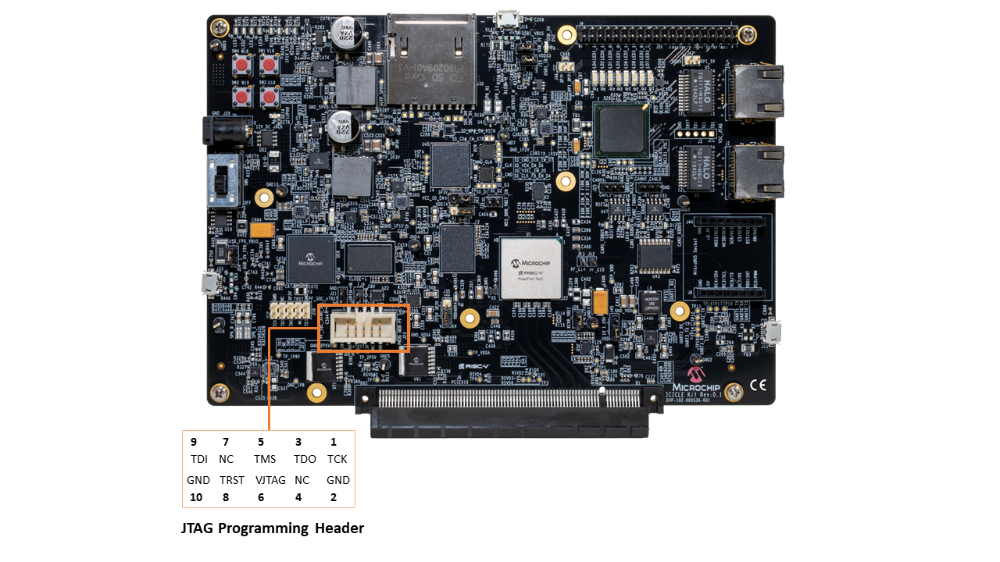

# JTAG DirectC

Microchip JTAG DirectC is a command line application used to program Microchip Polarfire/Polarfire SoC over JTAG, using a BeagleBone Black or Raspberry Pi.

## Hardware Requirements

- PolarFire/Polarfire SoC
- BeagleBone Black or Raspberry Pi 2 and newer model

## Pre-Requisites

[Libero SoC Design Suite](https://www.microchip.com/en-us/products/fpgas-and-plds/fpga-and-soc-design-tools/fpga/libero-software-later-versions) should be used to generate and extract the bitstream.

### Using the reference design to generate design and extract bitstream

1. Clone or download the [Icicle kit reference design repository](https://github.com/polarfire-soc/icicle-kit-reference-design)
2. Open Libero SoC Design Suite
3. Open the execute script dialog (CTRL+U)
4. Execute the "MPFS_ICICLE_KIT_REFERENCE_DESIGN.tcl" script
5. Add **EXPORT_FPE** argument to run the full design flow
6. With the EXPORT_FPE argument, the design flow will automatically start running. There is no action required by the user until the design flow is completed
7. After completion, in the Design Flow tab, go to Handoff Design for Production, double-click Export Bitstream and select export
8. Choose DAT as the format in the Export Bitstream window and click OK to generate the DAT file in the default location: `icicle-kit-reference-design/MPFS_ICICLE/designer/MPFS_ICICLE_KIT_BASE_DESIGN/export`

## Pin Assignment

Connect the following GPIO pins of BeagleBone Black or Raspberry Pi to the JTAG Programming Header (J23) on the target device.

|   `Target Device`  | `BeagleBone Black` |  `Raspberry Pi` |
| ------------------ |--------------------|-----------------|
|        TCK         |   P9_12 (GPIO_60)  | Pin 07 (GPIO04) |
|        TDI         |   P9_15 (GPIO_48)  | Pin 03 (GPIO02) |
|        TMS         |   P8_15 (GPIO_47)  | Pin 05 (GPIO03) |
|        TRST        |   P8_16 (GPIO_46)  | Pin 08 (GPIO14) |
|        TDO         |   P8_26 (GPIO_61)  | Pin 10 (GPIO15) |
|        GND         |        GND         |      GND        |

**Note**:

- "Raspberry Pi is a trademark of Raspberry Pi Foundation"
- "BeagleBone is a trademark of BeagleBoard.org®"

### JTAG Programming Header Pinout



## Build instructions

Before building the application, copy the DAT file to the working directory.

To build the application:

```bash
$ make
```

To enable JTAG programming:

```bash
$ ./directc_programmer -a`<action>` programmingfile.dat
```

To display help:

```bash
$ ./directc_programmer -h
```

To program the bitstream, select the **program** action:

```bash
$ ./directc_programmer -aprogram programmingfile.dat
```

For example when the **device_info** action is selected:

```bash
$ ./directc_programmer -adevice_info programmingfile.dat
```

## References

[Getting Started with BeagleBone Black](https://beagleboard.org/getting-started)

[Getting Started with Raspberry Pi](https://www.raspberrypi.com/documentation/computers/getting-started.html)

[Polarfire SoC Icicle Kit quick start guide](https://www.microsemi.com/products/fpga-soc/polarfire-soc-icicle-quick-start-guide)

[PolarFire SoC Icicle Kit Schematics](https://ww1.microchip.com/downloads/aemDocuments/documents/FPGA/ProductDocuments/ReferenceManuals/mpfs-icicle-kit-es-schematics.pdf)

[Icicle kit reference design](https://github.com/polarfire-soc/icicle-kit-reference-design)